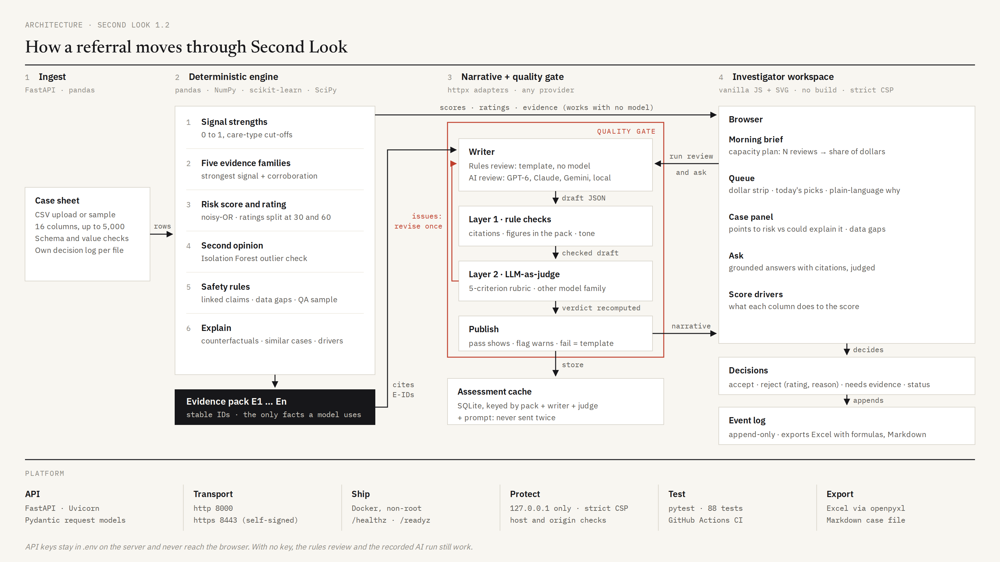

# Second Look

Second Look triages a queue of long-term care fraud referrals before an investigator opens it. Each case gets a risk score, a risk rating, a short assessment that cites its evidence, and a suggested next step. The investigator accepts or rejects each finding, moves the case through review, and can ask questions about it.



A rules engine computes every score. A language model is optional: it writes the assessment and answers questions, and every draft is checked against the case's evidence before anyone sees it. Without an API key, the app shows a recorded model run for the 50 sample cases.

## Run it

Needs Python 3.11 or newer.

```bash
git clone https://github.com/arunbodd/second-look.git
cd second-look
python3 -m venv .venv
source .venv/bin/activate        # Windows: .venv\Scripts\activate
pip install -r requirements.txt
python serve.py
```

Open http://127.0.0.1:8000. The app also serves https on 8443 with a self-signed certificate, so the browser asks you to accept it once. If a port is taken, the next free one is used and printed. Use `python serve.py --http-only` for plain http.

On a Mac, double-click `run_app.command` instead. It creates the virtualenv, installs packages, and opens the browser. If macOS says you lack permission, run `chmod +x run_app.command` once.

Docker: `docker compose up --build`, then open http://127.0.0.1:8000.

Tests: `pip install -r requirements-dev.txt && pytest -q`

## What the brief asked for

| Requirement | Where it is |
|---|---|
| Load the 50 cases from the CSV | Loaded and scored at startup from `data/sample_cases_synthetic.csv`; any CSV with the same columns can be uploaded |
| An AI assessment per case: summary, key signals, risk level, next step | The case panel: a summary, key indicators with evidence citations, a risk score and rating, and a recommended next step |
| Navigate the queue and drill into a case | The home page lists all 50 cases in a table you can search and filter. Clicking a row opens that case's full details in a panel on the right, and the `j` and `k` keys move to the next or previous case |
| Interact with a case | Accept or reject the finding with a reason, mark it as needing evidence, agree or disagree with each indicator, add notes, ask follow-up questions, and export a case file |

## How it reasons about a case

Each case goes through three steps, and only the second uses a language model.

1. **Score.** A rules engine turns the ten signal columns into a risk score from 0 to 100. Related signals are grouped into five evidence families (double billing, care not delivered, billing anomalies, timing and history, and member-provider relationship), so one pattern is not counted several times. An Isolation Forest outlier check gives a second opinion, and the engine records confidence with its reasons.
2. **Write.** The engine builds an evidence pack: numbered items (E1, E2, and so on) that each state the fact, the assumption behind it, and the innocent explanations to rule out. One model call writes the assessment from that pack alone. There is no retrieval, web search, or tool use, because the pack already holds everything the model may say.
3. **Check.** Automated checks reject citations that do not exist, figures that are not in the pack, a missed top driver, and wording that overstates the risk or accuses anyone. A second model, from a different maker, then scores the draft on five criteria. A draft with issues is sent back for one rewrite, and a draft that fails review is replaced by the engine's template text.

The model never sets the score or the rating, so a model error can change the wording of an assessment but not which cases get reviewed.

**Beyond 50 cases.** The engine scored 5,000 cases in about 80 seconds in a single process, most of it spent finding similar cases. Model calls cost more: about half a cent and 15 seconds per case on this data, with three cases running at a time. At scale I would run scoring as a nightly batch, index similar cases with an approximate nearest-neighbour search, send only suspicious and needs-review cases to a model, judge a sample of the rest, and keep the cache so unchanged cases are never sent twice.

## Trade-offs and risks

- **Cut.** Sign-in and roles, provider and member network analysis (the file has no provider or member IDs), and a trained model (50 unlabeled rows would be memorized).
- **With more time.** Calibrate the thresholds and weights against confirmed outcomes, learn from rejections and indicator votes, and test the judge against a human-labeled set.
- **Accuracy.** Evidence citations and automated checks catch invented facts and figures. A small judge is lenient, so production should use a stronger one.
- **Cost and latency.** Nothing is sent until someone presses Run, every call's tokens and cost are shown, and results are cached.
- **Trust.** A wrong fast-close is the expensive mistake, so a low-risk case goes to review instead of a fast close when it shares a claim number with a suspicious case, when the outlier check disagrees, or when a key signal is missing. The four unverified upstream flags alone cannot make a case suspicious.
- **Abuse.** The prompts treat case data as data, the model has no tools that act, and the app only listens on this computer.

## How a human stays in the loop

- **Trust.** Every statement cites evidence, and clicking a citation opens the item with its assumption and counter-arguments. Each score breaks down into evidence families, and the panel shows what would lower it.
- **Validate.** Investigators agree or disagree with each indicator and can read the automated checks and the judge's scores for every assessment. One in ten likely false positives is held back for a full review, to measure what the triage misses.
- **Override.** The AI recommends and the investigator decides. A rejection requires the rating the investigator would give and a reason, and is logged next to the AI's original call.
- **Audit.** Every model output and every human action goes to an append-only log that exports to Excel and a Markdown case file.

## What's in the app

- **Morning brief.** How many referrals look suspicious, what share of claim dollars they hold, and how much of the money at risk today's picks cover.
- **Queue.** Cases sorted by risk and dollars at risk, with the evidence behind each score.
- **Case panel.** The assessment, what points to risk beside what could explain it, the ten signals, the evidence pack, and the decision buttons. Keys: `j`/`k` to move, `a` to accept, `Esc` to close.
- **Rules review and AI review.** The same queue with template text or model-written text.
- **Score drivers.** What each signal does to the score in the loaded file, and which signals move together.
- **Exports.** A Markdown case file per case and an Excel workbook of the queue.

To triage your own data, use **Data → Upload a case sheet** with the same columns as `data/sample_cases_synthetic.csv`.

## Language models (optional)

Add a key to `.env` (copy `.env.example`), start the app, and pick a writer and a judge in the **Models** menu. Nothing is sent to a model until you press **Run**.

| Key | Models |
|---|---|
| `OPENAI_API_KEY` | GPT-6 Astra, Sol, and Luna |
| `ANTHROPIC_API_KEY` | Claude Fable 5.1, Opus 5.5, Sonnet 5, and Haiku 4.5 |
| `GEMINI_API_KEY` | Gemini 3.1 Pro and 3.8 Flash |
| `PERPLEXITY_API_KEY` | GPT, Claude, and Gemini models through Perplexity's Agent API, with web search off |

Use a judge from a different model maker than the writer, because models grade their own writing too kindly. The app warns when they match.

To set a default pair, or to use a local or other OpenAI-compatible server (Ollama, LM Studio, vLLM, OpenRouter), set `LLM_PROVIDER`, `LLM_MODEL`, `LLM_BASE_URL`, and `LLM_API_KEY` in `.env`, and the same `JUDGE_*` variables for the judge. `LLM_PROVIDER=litellm` works with any provider LiteLLM supports after `pip install litellm`.

Model output is cached by evidence, model pair, and prompt version, so the same case is never sent twice. The app counts tokens and cost for every call and shows them in the run bar and on each case.

### Recorded run

`data/recorded_review.json` holds one real run: GPT-6 Luna writing and Gemini 3.1 Flash-Lite judging, both through Perplexity, for all 50 cases, plus answers to the ten starter questions for the suspicious cases. It cost $0.33. The app shows it when no key is set. A case whose evidence has changed since the recording shows "not run".

Re-record with `python -m app.record` (options: `--writer`, `--judge`, `--max-cost`, default $2).

## Security

The app has no sign-in, so it listens on 127.0.0.1 only and cannot be reached from your network or public Wi-Fi. Starting it on another address needs `--allow-network`.

It also refuses requests addressed to an unknown host name, which blocks DNS rebinding, and write requests from other websites, so a page open in your browser cannot start a model run or change data. Docker publishes the port on 127.0.0.1 only.

## Configuration

| Variable | Default | Meaning |
|---|---|---|
| `LLM_PROVIDER`, `LLM_MODEL`, `LLM_BASE_URL`, `LLM_API_KEY` | offline | Default writer model |
| `JUDGE_PROVIDER`, `JUDGE_MODEL`, `JUDGE_BASE_URL`, `JUDGE_API_KEY` | same as writer | Default judge model |
| `JUDGE_ENABLED` | `true` | `false` runs the automated checks only |
| `JUDGE_MAX_REVISIONS` | `1` | Rewrites allowed after the judge flags a draft |
| `LLM_REASONING_EFFORT` | `low` | Reasoning effort for GPT-5 and GPT-6 models |
| `LLM_MAX_CONCURRENCY` | `3` | Model calls run at once |
| `RECORDED_REVIEW` | `data/recorded_review.json` | Recorded run file; `off` disables it |
| `ALLOWED_HOSTS` | (empty) | Extra host names, for a deployment behind a proxy |
| `DATA_PATH` | `data/sample_cases_synthetic.csv` | Case sheet loaded at startup |
| `DB_PATH` | `data/triage.db` | Decision log (SQLite) |

To start over, use **Data → Reset decisions and notes**, or delete `data/triage.db` and `data/assessment_cache.db`.

## Layout

```
app/engine/     signals, scoring, evidence pack, template text
app/llm/        model adapters, prompts, writer, chat, token accounting
app/quality/    automated checks and the model judge
app/static/     the web page (no build step)
app/            service, API, workflow, event store, network checks, Excel export
data/           sample cases and the recorded run
docs/           architecture diagram and its generator
tests/          88 tests
```
